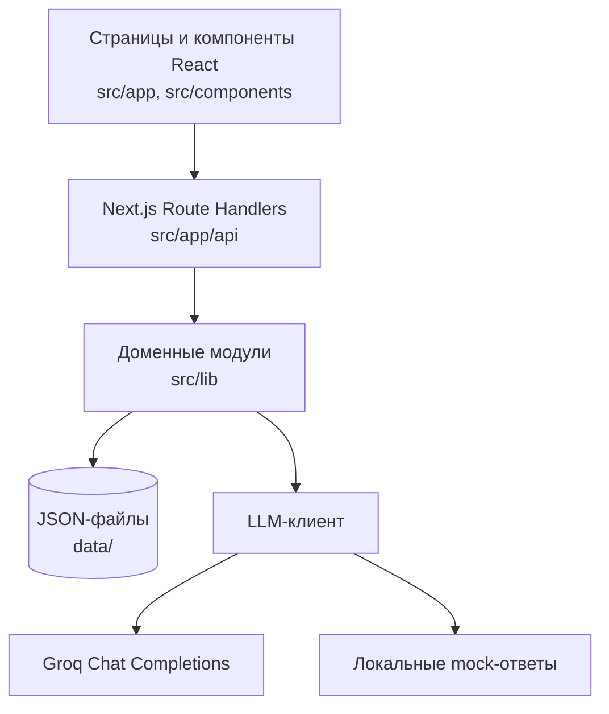

# Документация проекта «Переговорный штаб»

Единое руководство по запуску, использованию и техническому устройству приложения. Документы [README.md](README.md) и [TECHNICAL.md](TECHNICAL.md) сохранены; этот файл объединяет их содержание. Визуальные решения и UX-ограничения описаны отдельно в [DESIGN.md](DESIGN.md) и [UX.md](UX.md).

## Содержание

- [Продукт и быстрый старт](#продукт-и-быстрый-старт)
- [LLM и сборка](#groq-llm)
- [Данные и пользовательские потоки](#хранение-сценариев)
- [Архитектурные границы](#1-назначение-и-границы-системы)
- [Стек и структура модулей](#2-технологический-стек)
- [Доменные потоки и HTTP API](#4-основные-доменные-потоки)
- [Хранение, приватность и безопасность](#6-хранение-и-согласованность-данных)
- [Команды разработки и развитие системы](#8-конфигурация-и-команды-разработки)

## Продукт и быстрый старт

Прототип хакатон-концепта **C**: учебный симулятор переговоров с ИИ-оппонентом, внутренним советником, «температурой сделки» и итоговым отчётом.

Стек: **Next.js App Router + TypeScript + Tailwind**. UI на русском.

## Быстрый старт (mock, без ключей)

```bash
cd negotiation-arena-app
cp .env.example .env.local
# LLM_MOCK=1 уже в примере — mock включён
npm i
npm run dev
```

Откройте [http://localhost:3000](http://localhost:3000).

- **Игрок** (`/`): начать с трёх разных ситуаций — пилот, дедлайн, повышение зарплаты — либо выбрать один из девяти учебных сценариев каталога → пройти раунд → получить исход, оценки навыков, цитаты из своих реплик и ссылки на теорию → повторить сценарий с одним изменённым условием и сравнить результаты.
- **Админ** (`/admin`): создать или отредактировать сценарий, сохранить черновик, проверить его в предпросмотре и локально опубликовать.

В каталоге доступны девять сценариев: повышение зарплаты и пять кейсов о скидке, росте цены поставщика, конфликте в команде, вопросах партнёра и неясных ролях, плюс три исходных кейса. Три стартовые карточки показывают кейсы о пилоте, дедлайне и карьере. Все сценарии и реплики оппонентов работают в детерминированном mock-режиме без ключей.

## Groq LLM

Тонкий клиент: `src/lib/llm/client.ts`.

| Переменная | Назначение |
|---|---|
| `GROQ_API_KEY` | Ключ Groq API; хранить только в `.env.local` |
| `GROQ_MODEL` | ID модели; по умолчанию `openai/gpt-oss-120b` |
| `LLM_MOCK` | `1` — принудительный mock |

Запрос: `POST https://api.groq.com/openai/v1/chat/completions` с `Authorization: Bearer …`. Используется существующий HTTP-клиент без дополнительного SDK.

Если ключ отсутствует, запрос падает или `LLM_MOCK=1` — используются детерминированные mock-ответы. При ошибке Groq сервер пишет статус в лог. Секреты не коммитить: `.env.example` содержит только пустое поле ключа.

Для живого API создайте ключ в [Groq Console](https://console.groq.com/keys) и задайте в `.env.local`:

```bash
GROQ_API_KEY=ваш_ключ
GROQ_MODEL=openai/gpt-oss-120b
LLM_MOCK=0
```

Проверка живого подключения после запуска приложения с `LLM_MOCK=0` и заданным ключом:

```bash
curl -sS -X POST http://localhost:3000/api/character \
  -H 'Content-Type: application/json' \
  -d '{"role":"директор по закупкам","sphere":"IT","tone":"деловой"}'
```

В ответе `mock: false` означает, что ответ получен от Groq; `mock: true` означает запасной режим. На экране `/admin` источник ответа также указан после генерации персонажа.

## Сборка

```bash
npm run build
npm start
```

`npm run dev`, `npm run start` и `npm run build` используют общий `.next`. Перед пересборкой остановите работающий сервер: замена артефактов под запущенным процессом может вызвать `Cannot find module './*.js'` или загрузку страницы без CSS (404 старого хеша). Если это произошло, остановите сервер, выполните `npm run build` и заново запустите `npm run start`; для dev достаточно перезапуска `npm run dev`. Проверяйте не только HTML, но и успешную загрузку stylesheet и реальную ширину страницы. Эта проверка не заменяет визуальную приёмку.

`GET /api/health` возвращает статус локального приложения. После `npm run dev` можно выполнить сквозной mock smoke-check обоих исходов: `BASE_URL=http://127.0.0.1:3000 npm run smoke`.

### Проверка в среде с ограниченной сетью

Если `npm ci` завершается сообщением `Exit handler never called!`, проверьте npm-лог: причиной может быть `ENOTFOUND registry.npmjs.org`. Смена каталога npm-кэша сама по себе эту ошибку не устранила; установка прошла после предоставления сетевого доступа. Сборка также загружает Inter и JetBrains Mono через `next/font` и в среде без доступа к `fonts.googleapis.com` завершалась ошибкой. После разрешения сетевого доступа `npm ci`, `npm run lint` и `npm run build` прошли. Это не проверяет живой Groq API без `GROQ_API_KEY`.

## Хранение сценариев

Файловый стор: `data/scenarios.json` (+ сид в коде). Админ может сохранить локальный сценарий, скачать JSON, сохранить черновик и открыть его в предпросмотре; игрок — загрузить JSON на главной. Варианты повтора сохраняют начальный сценарий и seed попытки, меняя ровно один параметр.

Попытки сохраняются атомарно в `data/attempts.json`; в браузере хранится только ID активной попытки. Обновление страницы восстанавливает раунд или готовый отчёт. Повтор использует снимок сценария предыдущей попытки, даже если настройки сценария изменились. Это локальное однопроцессное демо: файл не рассчитан на несколько экземпляров сервера или эфемерный production-диск.

Публичные `GET /api/scenarios` ответы скрывают системный промпт, цели, красные линии, ограничения и скрытые интересы оппонента. `POST /api/scenarios` пока доступен без авторизации, поэтому `/admin` и локальная публикация безопасны только в доверенном локальном демо и не должны выставляться в интернет. Для совместной или production-среды нужны аутентификация и разграничение доступа, а также постоянное общее хранилище.

## Демонстрационный маршрут

1. Запустите `cp .env.example .env.local && npm install && npm run dev` без ключа Groq (`LLM_MOCK=1`).
2. На `/` выберите кейс; например, «Клиент требует скидку».
3. В mock-режиме уточните причину запроса и обменяйте уступку на встречное условие. Для альтернативного исхода обещайте скидку без встречного обязательства.
4. Завершите раунд. Цитаты отчёта берутся из сохранённых сообщений; ссылки ведут на `/learn`. Выберите одно новое условие для повтора. После повторного раунда отчёт покажет изменение условия и разницу результатов.
5. На `/admin` задайте роль, интересы и правила исходов; сохраните черновик, проверьте его через предпросмотр и локально опубликуйте. Новая версия применяется к новым попыткам; активные попытки продолжают использовать сохранённый снимок.

Идентификаторы событий и оценки — прозрачные учебные эвристики по тексту реплик, а не объективная оценка переговорщика. Админ API не защищён; публичное многопользовательское развёртывание требует авторизации и постоянного хранилища.

## Групповые комнаты и сброс локального демо

На `/group` доступны приглашения в шаблоны «Клиент и продавец» и «Команда защищает план проекта», поиск случайного соперника для 1×1, а также индивидуальная практика против руководителя и заказчика-ботов. Ссылку-приглашение получает создатель; она резервирует одно место и перестаёт действовать после подключения второго участника. Реплики доступны только по случайному токену участника; на диск записывается его SHA-256-хеш. Роль и персональный бриф выдаются только по токену этой роли. Состояние комнаты и история хранятся в `data/group-rooms.json`, поиск соперника — во временном `data/group-matchmaking.json`; между перезапусками локального процесса данные комнат сохраняются, поиск ожидает не более трёх минут. Браузер хранит токен своей комнаты в localStorage.

JSON-хранилища (`data/attempts.json`, `data/group-rooms.json`, `data/group-matchmaking.json`) относятся к локальному демо. Явный сброс попыток, комнат и очереди перед демонстрацией:

```bash
npm run demo:reset -- --confirm
```

Без `--confirm` команда завершится, не меняя файлы. Сценарии `data/scenarios.json` и seed в коде остаются на месте. Обычный запуск ничего не очищает.

Файловая синхронизация защищена только внутри одного процесса Node.js; она не рассчитана на несколько процессов/экземпляров или эфемерный диск. Поиск использует локальную общую очередь для одного процесса и один фиксированный шаблон 1×1. Черновая PostgreSQL-схема для переноса комнат находится в `db/migrations/001_group_rooms.sql`, но адаптер БД, аккаунты и межэкземплярная синхронизация ещё не подключены. Поэтому приглашения и подбор подходят для доверенного локального демо, но не для публичного запуска. Голос в групповой комнате ждёт завершения индивидуальной интеграции MYO-127/128.

## Out of scope

Голос, полный граф сценариев, assessment suite, авторизованная публикация сценариев и общее production-хранилище.


---

# Техническая часть

## 1. Назначение и границы системы

Приложение — русскоязычный учебный симулятор переговоров. Игрок проходит индивидуальные сценарии с ИИ-оппонентом, получает отчёт по репликам и может сравнить повторную попытку. Также реализованы групповые комнаты, учебные материалы, профиль прогресса и локальное управление сценариями.

Это демонстрационный Next.js-проект с файловым хранилищем. Он не предоставляет полноценную аутентификацию пользователей, многопользовательскую авторизацию для административных действий, общую базу данных или гарантии работы при нескольких экземплярах приложения. Наличие HTTP API не означает готовность к публичному production-развёртыванию.

## 2. Технологический стек

- Next.js 15 с App Router и серверными Route Handlers.
- React 19 и TypeScript.
- Tailwind CSS 4 и проектные стили в `src/app/globals.css`.
- GSAP для отдельных интерфейсных анимаций.
- Node.js API: `fs/promises`, `path`, `crypto`, `fetch`.
- Groq Chat Completions API для генерации ответов; детерминированный mock — резервный режим.
- JSON-файлы в `data/` как локальное постоянное хранилище.

Проверить фактические версии библиотек можно в `package.json` и `package-lock.json`.

## 3. Архитектура приложения



Страницы собираются маршрутизацией App Router. Клиентские компоненты взаимодействуют с серверными обработчиками `/api/...`; обработчики валидируют вход, вызывают функции `src/lib` и возвращают JSON. Доменные модули отвечают за сценарии, попытки, прогресс, группы и работу с языковой моделью. Серверное состояние хранится в файлах под `data/`.

### Основные директории

| Путь | Ответственность |
|---|---|
| `src/app/` | Страницы приложения, корневой layout, глобальные стили и API-маршруты. |
| `src/app/api/` | HTTP Route Handlers для сценариев, попыток, групп, профиля и вспомогательных функций. |
| `src/components/` | Общие UI-компоненты, включая `PlayArena`, `FinalReport`, `AdvisorSidebar`, `WorkspaceNav` и `TemperatureMeter`. |
| `src/lib/scenarios/` | Типы, встроенные сценарии, файловый каталог, публичное представление и проверка сценария. |
| `src/lib/attempts/` | Создание попыток, сохранение реплик, выделение сигналов, оценка исхода и построение отчёта. |
| `src/lib/group-rooms/` | Комнаты, приглашения, участники, очередь реплик и локальный matchmaking. |
| `src/lib/progress/` | Профиль игрока, агрегирование навыков, достижения и локальный рейтинг. |
| `src/lib/llm/` | Типы сообщений, промпты, Groq-клиент и mock-логика. |
| `data/` | Состояние локального демо в JSON; содержимое зависит от работы пользователя и не является схемой базы данных. |
| `db/migrations/` | Черновая SQL-схема групповых комнат для возможной миграции; приложение её пока не использует. |
| `scripts/` | Smoke-сценарий и явный сброс локальных демо-данных. |

### Пользовательские страницы

| URL | Файл | Назначение |
|---|---|---|
| `/` | `src/app/page.tsx` | Старт, каталог и запуск сценария. |
| `/play` | `src/app/play/page.tsx` | Индивидуальный раунд и диалог. |
| `/admin` | `src/app/admin/page.tsx` | Локальное создание, редактирование и предпросмотр сценариев. |
| `/group` | `src/app/group/page.tsx` | Групповые комнаты, приглашения и практика с ботами. |
| `/progress` | `src/app/progress/page.tsx` | История, навыки и достижения профиля. |
| `/diagnostic` | `src/app/diagnostic/page.tsx` | Диагностический режим. |
| `/learn` | `src/app/learn/page.tsx` | Учебные материалы, на которые ссылаются отчёты. |

## 4. Основные доменные потоки

### 4.1 Сценарии

Сценарии имеют тип `Scenario` из `src/lib/scenarios/types.ts`. В нём описаны бриф игрока и роль оппонента, скрытые параметры оппонента, правила исходов, сигналы, теоретические материалы и варианты повторной попытки.

`src/lib/scenarios/seed.ts` содержит встроенный набор. `src/lib/scenarios/store.ts` объединяет seed и пользовательские записи из `data/scenarios.json`; встроенные возможности сценария сохраняются при чтении. Черновики могут запрашиваться отдельно для административного предпросмотра. `validateScenario` выполняет базовую проверку структуры, а не полную семантическую проверку каждого правила.

Перед возвратом сценария игроку используется `toPublicScenario`: из ответа удаляются правила исхода и сигналы, а объект оппонента ограничивается публичными полями. Системный промпт, цели, красные линии, ограничения и скрытые интересы остаются серверными данными.

### 4.2 Индивидуальная попытка

1. Клиент создаёт попытку с `scenarioId` и режимом практики.
2. `src/lib/attempts/store.ts` загружает сценарий и сохраняет снимок его версии в записи попытки. Повтор связывается с предыдущей попыткой и может изменить одно условие на основе детерминированного seed.
3. При отправке реплики сервер строит сообщения для оппонента и запрашивает `chatCompletion`.
4. Реплика игрока и ответ сохраняются вместе. По тексту игрока фиксируются сигналы навыков — встроенными регулярными выражениями и шаблонами сценария.
5. При завершении правила сценария сопоставляются с сигналами. По результату строится отчёт с исходом, баллами навыков, цитатами, рекомендациями и, при допустимом повторе, сравнением.

Оценка является учебной эвристикой: это соответствие текстовых сигналов и заданных правил, а не объективная психометрическая оценка. Отчёт опирается на сохранённые реплики. Повтор использует снимок предыдущего сценария, чтобы позднее редактирование каталога не переписывало прошлую попытку.

### 4.3 Groq и mock

Единая точка обращения — `src/lib/llm/client.ts`. По умолчанию клиент отправляет запрос на Groq Chat Completions; API-ключ и модель задаются переменными окружения. Mock включается при `LLM_MOCK=1`, автоматически используется без ключа, а также как запасной ответ при HTTP-ошибке, пустом ответе или исключении. Резервный ответ отмечается флагом `mock` в API-ответе.

Ключ должен находиться только на серверной стороне в `.env.local`. Не добавляйте секреты в клиентский код, JSON сценариев, скриншоты, коммиты или документацию.

## 5. HTTP API

Обработчики находятся в `src/app/api/`. Ниже перечислены основные группы маршрутов; конкретную форму запроса и ответа следует сверять с соответствующим `route.ts`.

| Маршрут | Назначение |
|---|---|
| `GET /api/health` | Проверка доступности приложения. |
| `GET /api/scenarios` | Список публичных сценариев; черновики исключены по умолчанию. |
| `GET /api/scenarios/[id]` | Получение опубликованного сценария. Черновик через этот маршрут не возвращается. |
| `POST /api/scenarios` | Сохранение сценария. Сейчас не требует аутентификации. |
| `DELETE /api/scenarios?id=...` | Удаление пользовательского сценария согласно проверкам обработчика. |
| `POST /api/attempts` | Создание попытки, в том числе повтора. |
| `GET /api/attempts?id=...` | Получение попытки по идентификатору. |
| `POST /api/attempts/turn` и `POST /api/attempts/[id]/messages` | Отправка реплики и получение ответа оппонента. |
| `POST /api/attempts/complete` и `POST /api/attempts/[id]/finish` | Завершение попытки и формирование отчёта. |
| `GET /api/progress?profileId=...`, `PUT /api/progress` | Чтение и сохранение локального профиля/прогресса. |
| `GET /api/leaderboard` | Псевдонимный рейтинг по сценарию, версии и сложности. |
| `/api/group-rooms` | Создание комнаты, подключение по приглашению и вход в подбор. |
| `/api/group-rooms/[id]` | Получение состояния комнаты по токену участника. |
| `/api/group-rooms/[id]/messages` | Добавление реплики участника. |
| `/api/group-rooms/[id]/finish` | Завершение участия/комнаты. |
| `/api/group-matchmaking/[id]` | Проверка или отмена локального подбора соперника. |
| `POST /api/chat`, `/api/advisor`, `/api/temperature`, `/api/report`, `/api/character` | Вспомогательные ответы оппонента, советника, индикатора температуры, отчёта и генерации персонажа. |

Маршруты используют стандартные HTTP-коды для ошибок валидации, отсутствующих ресурсов и конфликтов завершённого раунда. Это не единая версионированная публичная API: совместимость между версиями пока отдельно не гарантируется.

## 6. Хранение и согласованность данных

| Файл | Данные |
|---|---|
| `data/scenarios.json` | Переопределения встроенных и пользовательские сценарии. Может отсутствовать, если используются только seed-данные. |
| `data/attempts.json` | Индивидуальные попытки, сообщения, сигналы и отчёты. |
| `data/profiles.json` | Псевдоним, настройки рейтинга и калибровочные ответы профиля. |
| `data/group-rooms.json` | Комнаты, участники и история групповых реплик. Токены участников сохраняются в виде SHA-256-хеша. |
| `data/group-matchmaking.json` | Временные билеты локальной очереди matchmaking; токен билета хранится хешированным. |

Большинство хранилищ записывают новый временный файл и затем переименовывают его на место исходного, чтобы снизить риск частично записанного JSON. Для группового хранилища операции дополнительно сериализуются очередью Promise внутри одного процесса Node.js. Эти приёмы не обеспечивают транзакции между процессами и не заменяют базу данных.

Операции читают и переписывают JSON-массив целиком. При росте данных это увеличивает задержку и расход памяти; одновременная работа нескольких процессов, контейнеров или серверless-инстансов может привести к потере обновлений. Для публичной многопользовательской версии необходимы общее постоянное хранилище, транзакции, миграции и межэкземплярная синхронизация.

## 7. Приватность и границы безопасности

- Публичный DTO сценария намеренно исключает скрытые инструкции и критерии оппонента. При добавлении API-полей сохраняйте этот барьер и проверяйте все сериализаторы.
- Административные операции над сценариями не защищены входом в аккаунт или ролью. UI `/admin` не является контролем доступа; нельзя публиковать такую конфигурацию в интернете.
- Идентификатор профиля не является аутентификацией. Текущая модель не доказывает владение профилем вызывающим пользователем.
- Групповые маршруты проверяют токен участника; в JSON хранится хеш токена. Сам токен выступает bearer-секретом и должен храниться клиентом осторожно.
- Рейтинг возвращает псевдоним, лучший балл и число попыток только для профилей с включённой настройкой публикации; переписка не используется как публичная строка рейтинга.
- Не записывайте API-ключи или полные чувствительные данные в логи. Текущие ошибки провайдера логируют статус или исключение; перед публичным запуском нужно провести отдельный security review.

## 8. Конфигурация и команды разработки

Переменные окружения описаны в `.env.example`:

| Переменная | Назначение |
|---|---|
| `GROQ_API_KEY` | Секрет для живого вызова Groq. Оставьте пустым для локального mock. |
| `GROQ_MODEL` | Идентификатор модели; при отсутствии используется значение по умолчанию из `src/lib/llm/client.ts`. |
| `LLM_MOCK` | Значение `1` принудительно включает mock. |

Команды из `package.json`:

```bash
npm run dev       # локальный сервер разработки
npm run lint      # ESLint
npm run build     # production-сборка Next.js
npm start         # запуск собранного приложения
npm run smoke     # HTTP smoke-сценарий для уже запущенного приложения
npm run demo:reset -- --confirm  # явный сброс локальных попыток и групповых данных
```

`npm run smoke` использует `BASE_URL` (по умолчанию задайте адрес уже запущенного сервера), например:

```bash
BASE_URL=http://127.0.0.1:3000 npm run smoke
```

Скрипт сброса требует `--confirm`; обычный старт приложения данные не очищает. До сброса сохраняйте нужные материалы. `npm run dev` и `npm run build` используют `.next`; не запускайте их одновременно в одной рабочей копии. Быстрая проверка и известные ограничения среды описаны выше.

## 9. Групповые комнаты

`src/lib/group-rooms/store.ts` реализует конечные состояния `waiting`, `active` и `completed`. При создании комнаты генерируются случайный код, приглашение и токен участника; приглашение хранится как хеш, а член получает роль и отдельный бриф. В комнате «клиент — продавец» обработчик ограничивает очередь ходов. В командных шаблонах локальные ответы ботов добавляются сервером. Подбор соперника работает через файловую очередь с трёхминутным сроком действия билета.

PostgreSQL-файл `db/migrations/001_group_rooms.sql` — заготовка направления миграции. Подключённого SQL-адаптера, реального обмена через websocket и межпроцессной блокировки в текущем файловом варианте нет; клиент должен повторно получать состояние комнаты через API.

## 10. Изменение системы

При добавлении новой возможности полезно сохранять разделение ответственности:

1. Определить доменный тип или контракт в соответствующем модуле `src/lib`.
2. Реализовать хранение и правила домена в этом модуле, а не дублировать их в React-компоненте.
3. Добавить или изменить Route Handler, проверив входные данные и ошибки.
4. Обновить UI и типы клиентских запросов.
5. Если изменяется сценарий, убедиться, что публичный DTO не возвращает скрытые данные.
6. Если меняется формат JSON, предусмотреть чтение старых записей или явно документировать необходимость сброса локального демо.
7. Сверить команды проверки с `package.json` и проверить фактическое поведение затронутого маршрута.

Документ отражает текущий код на дату его создания; при изменении API, моделей хранения, провайдера или границ доступа обновляйте соответствующие разделы вместе с реализацией.
